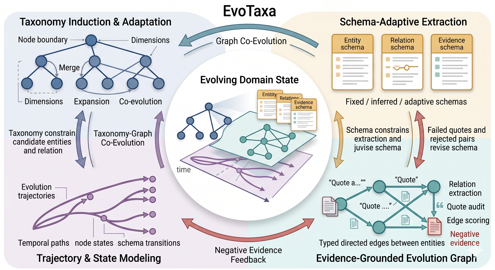

# EvoTaxa

EvoTaxa is a config-driven framework for taxonomy-guided, schema-adaptive, evidence-grounded evolution modeling.

The core idea is to model a domain as an evolving state, not just as a flat set of topics or co-mentioned entities. EvoTaxa jointly maintains:

- a taxonomy that defines domain regions and their boundaries,
- a schema that defines valid entity, relation, and evidence contracts,
- an evolution graph whose edges are quote-grounded and schema-constrained,
- a state model that records how taxonomy, schema, and relations change,
- a trajectory model that reconstructs plausible evolution paths.

`run-lite` is a deterministic version of this pipeline. It normalizes arbitrary domain data, enriches taxonomy nodes, extracts entities, builds typed evolution edges, audits quote evidence, separates trusted/candidate/unverified edges, infers local trajectories, and emits forecast or social-analysis hooks.

`run-full` adds the research modules: taxonomy induction when no taxonomy is provided, taxonomy expansion, optional LLM judging with cache/retry/schema validation, batched schema-guided relation extraction, adaptive schema revision, negative-evidence feedback, taxonomy-graph co-evolution, explicit state-transition artifacts, trajectory scoring, and run-level quality reporting.

For large social-science corpora, the current recommended workflow is staged: collect or normalize the corpus, run optional LLM relevance screening and abstract cleaning, probe the corpus-driven schema, run the main entity/state pipeline, extract strict successor edges, materialize node cards and trajectories, synthesize optional macro patterns, and inspect the result in the local evolution dashboard.

## Algorithm Flow



EvoTaxa runs as a closed-loop evolution modeling algorithm:

```text
corpus
  -> normalized documents and cutoff-aware slices
  -> taxonomy induction / enrichment / expansion
  -> entity extraction, linking, and quality filtering
  -> entity / relation / evidence schema resolution
  -> schema-guided relation extraction
  -> quote-grounded evidence audit
  -> edge scoring and trusted/candidate/unverified stratification
  -> taxonomy-graph co-evolution
  -> adaptive schema revision with negative evidence
  -> evolution state snapshot and state transitions
  -> trajectory inference and trajectory evaluation
  -> hooks, reports, ablations, and quality diagnostics
```

The important feedback loops are:

- **Taxonomy to graph**: taxonomy nodes constrain local entity pools, candidate relation pairs, and trajectory context.
- **Graph to taxonomy**: trusted edges and branch patterns trigger node split, cross-link, and state-annotation revisions.
- **Schema to graph**: entity, relation, and evidence schemas constrain extraction and judging.
- **Graph to schema**: failed quotes, weak edges, filtered entities, and rejected relation pairs become schema revision candidates.
- **Negative evidence to schema**: rejected relation pairs are persisted as negative priors and counterexamples, so weak co-mentions do not silently become evolution edges.
- **Edges to trajectories**: trusted edges are composed into evolution trajectories using temporal coherence, quote grounding, schema fit, and taxonomy locality.

This makes EvoTaxa suitable for AI research evolution modeling and for social-science domains such as policy, governance, misinformation, polarization, education, or platform labor.

## Why Config-Driven

EvoTaxa is not tied to ForeSci field names. A scientific paper corpus and a social-science corpus can use different fields as long as the config maps them into the minimal internal contract.

See [docs/input_contract.md](docs/input_contract.md).

## Install

```bash
pip install -e .
```

## Smoke Runs

Scientific research example:

```bash
python -m evotaxa.cli run-lite \
  --config configs/scientific_research.example.toml \
  --print-manifest
```

Social science example:

```bash
python -m evotaxa.cli run-lite \
  --config configs/social_science.example.toml \
  --print-manifest
```

Full pipeline:

```bash
python -m evotaxa.cli run-full \
  --config configs/social_science.example.toml \
  --print-manifest
```

Schema-only commands:

```bash
python -m evotaxa.cli infer-schema \
  --config configs/social_science.example.toml \
  --print-summary

python -m evotaxa.cli adapt-schema \
  --config configs/social_science.example.toml \
  --print-summary
```

Ablation suite:

```bash
python -m evotaxa.cli run-ablation \
  --config configs/social_science.example.toml \
  --variants default no_coevolution no_expansion no_edge_judge no_llm \
  --print-summary
```

Local OpenAI-compatible LLM development:

```toml
[graph]
llm_relation_batch_size = 4

[llm]
provider = "openai_compat"
model_name = "your-model-name"
api_key_env = "EVOTAXA_LLM_API_KEY"
base_url = "http://localhost:8001/v1"
enabled_tasks = [
  "entity_extraction",
  "taxonomy_candidate_judge",
  "relation_extraction_batch",
  "edge_evidence_judge",
  "schema_revision_judge",
  "relation_schema_inference",
  "entity_evidence_schema_inference",
]

[llm.extra_body.chat_template_kwargs]
enable_thinking = false
```

For committed configs, prefer `api_key_env` instead of a literal token.
Set `enabled_tasks = []` to disable model calls by default, or `enabled_tasks = ["*"]` to allow every LLM-backed task.
For extraction, screening, and structured judge tasks, keep `enable_thinking = false`; these tasks need compact JSON more than hidden reasoning. For deep analytic writing or theory-review tasks, use a separate local config and enable thinking only when the extra latency is acceptable.

For adaptive schema work, also enable `relation_schema_inference`, `entity_evidence_schema_inference`, and `schema_revision_judge`.

Adaptive social-science case study:

```bash
python -m evotaxa.cli run-full \
  --config configs/social_misinformation_governance.adaptive.toml \
  --print-manifest
```

## Large-Corpus Social-Science Workflow

The OpenAlex computational-social-science workflow is the current large-corpus reference path. It keeps expensive, domain-specific steps outside the default `run-full` command so each stage is auditable and resumable.
The current baseline is title/abstract based. Full-text acquisition, storage,
section extraction, and future incremental refresh rules are specified in
[docs/fulltext_literature_management.md](docs/fulltext_literature_management.md).

1. Download a corpus with resumable OpenAlex paging:

```bash
python scripts/download_openalex_corpus.py \
  --output-root data/computational_social_science
```

2. Optionally screen and clean title/abstract records before the main run. The screening code is generic; the rubric is domain-specific.

```bash
export EVOTAXA_LLM_API_KEY=...
python scripts/screen_relevance.py \
  --input data/computational_social_science_methods/raw/corpus.jsonl \
  --output-root data/computational_social_science_methods/screening/<run_id> \
  --rubric configs/relevance_domains/computational_social_science_methods.toml \
  --llm-config configs/llm/qwen_local.toml \
  --resume
```

3. Probe the corpus before fixing the node/schema design:

```bash
PYTHONPATH=src python scripts/probe_schema_design.py \
  --config configs/computational_social_science_methods.openalex.toml \
  --output-root runs/computational_social_science_methods/evolution/<probe_id> \
  --sample-size 240 \
  --seed 20260530

PYTHONPATH=src python scripts/propose_schema_from_probe.py \
  --base-config configs/computational_social_science_methods.openalex.toml \
  --probe-root runs/computational_social_science_methods/evolution/<probe_id> \
  --output-root runs/computational_social_science_methods/evolution/<probe_id>/mainflow_proposal
```

4. Run the main entity/state pipeline from the proposed config, then run successor extraction over the resulting entity cards. Successor extraction is resumable and supports parallel workers:

```bash
export EVOTAXA_LLM_API_KEY=...
PYTHONPATH=scripts:src python scripts/extract_successor_edges.py \
  --config runs/computational_social_science_methods/evolution/<probe_id>/mainflow_proposal/<successor_config>.json \
  --run-root runs/computational_social_science_methods/evolution/<probe_id>/mainflow_proposal/<run_id>/run_output \
  --output-root runs/computational_social_science_methods/evolution/<probe_id>/mainflow_proposal/<run_id>/successor_run \
  --candidate-limit 0 \
  --llm-limit <candidate_count> \
  --candidate-scope schema_group \
  --batch-size 4 \
  --workers 24 \
  --run-llm \
  --resume
```

Use `--candidate-limit 0` to keep all generated candidates. Set `--llm-limit` to the number of candidates you actually want the model to judge; `0` is a dry candidate-generation pass.

5. Install strict successor edges, materialize display artifacts, synthesize macro patterns, and build the dashboard:

```bash
PYTHONPATH=scripts:src python scripts/filter_successor_edges.py \
  --input-root runs/computational_social_science_methods/evolution/<probe_id>/mainflow_proposal/<run_id>/successor_run \
  --output-root runs/computational_social_science_methods/evolution/<probe_id>/mainflow_proposal/<run_id>/successor_run/strict_final \
  --run-root runs/computational_social_science_methods/evolution/<probe_id>/mainflow_proposal/<run_id>/run_output \
  --install

PYTHONPATH=scripts:src python scripts/materialize_evolution_artifacts.py \
  --run-root runs/computational_social_science_methods/evolution/<probe_id>/mainflow_proposal/<run_id>/run_output

PYTHONPATH=scripts:src python scripts/synthesize_successor_macro_patterns.py \
  --run-root runs/computational_social_science_methods/evolution/<probe_id>/mainflow_proposal/<run_id>/run_output

PYTHONPATH=scripts:src python scripts/build_evolution_visualization.py \
  --run-root runs/computational_social_science_methods/evolution/<probe_id>/mainflow_proposal/<run_id>/run_output \
  --max-nodes 1600 \
  --max-edges 1200 \
  --max-trajectories 1000

PYTHONPATH=scripts:src python scripts/build_evolution_insight_report.py \
  --run-root runs/computational_social_science_methods/evolution/<probe_id>/mainflow_proposal/<run_id>/run_output

python3 scripts/write_agentic_evolution_report.py \
  --run-root runs/computational_social_science_methods/evolution/<probe_id>/mainflow_proposal/<run_id>/run_output \
  --config config.yaml
```

Serve the dashboard locally:

```bash
python scripts/serve_evolution_dashboard.py \
  --run-root runs/computational_social_science_methods/evolution/<probe_id>/mainflow_proposal/<run_id>/run_output \
  --port 8765
```

The dashboard is a local inspection tool. It uses only strict successor edges for the evolution browser; co-occurrence and generic graph edges are not displayed as evolution.

## Output Layout

Each run writes a `manifest.json` plus a small set of domain-specific artifact directories under the configured `output.root`. The exact file set depends on the enabled modules, but the stable layout is:

```text
<output_root>/
  corpus/            normalized documents and corpus manifest
  taxonomy/          enriched, induced, expanded, and revised taxonomy artifacts
  schema/            fixed/inferred/final entity, relation, and evidence schemas
  graph/             entities, links, edge evidence, strict successors, and audits
  trajectory/        inferred evolution trajectories and successor trajectories
  macro_patterns/    detector-backed macro pattern profiles and evidence
  temporal_windows/  optional temporal windows and time-series signals
  visualization/     local dashboard HTML and dashboard summary
  reports/           deterministic and optional agentic evolution reports
  state/             explicit evolution state and state transitions
  hooks/             forecast and social-analysis hooks
  feedback/          taxonomy-graph feedback events
  evaluation/        intrinsic run quality report
  audit/             LLM records, cache, and low-confidence artifacts
  manifest.json
```

For large-corpus inspection, the files most users need first are `manifest.json`, `graph/entity_cards.jsonl`, `graph/successor_edges.accepted.jsonl`, `trajectory/successor_trajectories.jsonl`, `macro_patterns/pattern_profiles.jsonl`, `visualization/evolution_dashboard.html`, and `reports/evolution_insight_report.agent.md`.

## Config Sections

- `[project]`: domain metadata and run id.
- `[corpus]`: field mappings, accepted roles, cutoff policy, and source type.
- `[taxonomy]`: taxonomy node/assignment paths and field mappings.
- `[taxonomy.dimensions.*]`: domain-specific taxonomy dimensions.
- `[schema]`: fixed, inferred, or adaptive schema modes for entity, relation, and evidence schemas.
- `[graph]`: entity types, strong edge types, cue terms, extraction limits, and relation batch size.
- `[graph.entity_patterns]`: optional seed entities by entity type.
- `[graph.entity_aliases]`: canonical entity names mapped to aliases for entity linking.
- `[graph.entity_denylist]` / `[graph.entity_allowlist]`: manual entity quality overrides.
- `[graph.edge_cues]`: phrase cues for typed evolution edges.
- `[llm]`: optional OpenAI-compatible model configuration for candidate and edge judging.
- `[output]`: output root.

## Adaptive Schema Evolution

EvoTaxa treats schema as a versioned artifact. `[schema]` supports:

- `fixed`: use configured entity/relation/evidence contracts.
- `inferred`: infer a domain schema from corpus samples before extraction.
- `adaptive`: infer or load a schema, propose revision candidates from entity filtering and edge evidence audit signals, then promote bounded revisions.

The relation schema is injected into edge construction and LLM edge judging. The entity schema constrains quote-grounded entity extraction. The evidence schema defines which quote-backed slots are audited. Each run writes fixed, inferred, final, candidate, and promoted revision artifacts under `schema/`.

In `run-full`, enabling `relation_extraction_batch` lets the model create schema-guided relation edges from candidate entity pairs before the evidence judge audits them. Cue-based edges remain as a deterministic fallback and prior. Rejected relation pairs are also written as negative evidence so the run can explain what the model refused to connect.

When schema modes are `adaptive`, EvoTaxa can evolve the relation schema, entity schema, and evidence schema. A model-backed `schema_revision_judge` can decide whether each proposed schema revision should be promoted, rejected, or held for human review.

Rejected relation pairs also feed back into adaptive relation schemas as negative priors and counterexamples. This prevents weak co-mentions from being treated as future evolution edges and makes schema drift inspectable.

## Edge Evidence

Every edge is audited after construction. EvoTaxa checks quotes in `bottleneck`, `mechanism`, and `tradeoff` against the source and target documents, then writes:

- `graph/method_edges.trusted.jsonl`: strong edge types above the trusted confidence threshold with verified quote evidence.
- `graph/method_edges.candidate.jsonl`: plausible but weaker edges, including non-strong edge types and edges below the trusted threshold.
- `graph/method_edges.unverified.jsonl`: edges below the candidate threshold or lacking usable evidence.
- `graph/edge_evidence_audit.jsonl`: field-level quote checks and the reason for each edge status.
- `graph/edge_scores.jsonl`: relation confidence, quote grounding, temporal order, taxonomy locality, schema fit, evidence-slot completeness, and final edge score.
- `graph/relation_rejections.jsonl`: relation candidates rejected because they were weak co-mentions, comparison-only links, temporal violations, schema mismatches, or unsupported by quotes.

## Evolution State And Trajectory

EvoTaxa writes an explicit state layer:

- `state/evolution_state.json`: the current domain state, including document slices, taxonomy node states, entity mix, relation mix, and active schema.
- `state/state_transitions.jsonl`: taxonomy transitions, schema transitions, relation-quality transitions, and negative-relation transitions.

It also writes a trajectory layer:

- `trajectory/evolution_trajectories.jsonl`: inferred evolution trajectories scored by edge confidence, temporal coherence, quote grounding, schema coherence, and taxonomy locality.
- `trajectory/trajectory_eval.jsonl`: intrinsic trajectory health metrics.

The legacy `search/evolution_chains.jsonl` path is retained for compatibility, but the algorithmic layer is trajectory inference rather than search.

Hooks and feedback use trusted edges when available; if a run has no trusted edges, they fall back to candidate edges so small exploratory corpora still produce inspectable outputs.

## Successor Edges, Node Cards, And Dashboard

For large corpora, EvoTaxa separates generic relation extraction from strict successor extraction. Successor edges are directed predecessor-to-successor claims over materialized entities. They require temporal order, same schema group, relation type, confidence, and quote-grounded evidence. They are stored in `graph/successor_edges.accepted.jsonl` after filtering.

`scripts/materialize_evolution_artifacts.py` builds `graph/entity_cards.jsonl` and `trajectory/successor_trajectories.jsonl`. Entity cards preserve canonical names, readable display names, contextual names, schema groups, raw entity types, support documents, mentions, and incoming/outgoing successor edges.

`scripts/build_evolution_visualization.py` and `scripts/serve_evolution_dashboard.py` provide a local browser for the current run. The browser defaults to time-windowed strict successor evidence, supports month-level zoom, shows older concepts above newer concepts, exposes node cards and edge evidence, and lets macro patterns select their linked micro-level evidence.

For large runs, the main interpretation layers are:

- `graph/method_edges.*.jsonl`: generic relation artifacts from the core pipeline. They are useful for audit, scoring, and fallback hooks, but should not be treated as the primary evolution browser when strict successor edges are available.
- `graph/successor_edges.accepted.jsonl`: high-precision predecessor-to-successor claims. These are the preferred substrate for the dashboard, node-card lineage, successor trajectories, and successor-based macro patterns.
- `graph/entity_cards.jsonl`: inspectable concept cards with display names, contextual names, schema groups, supporting documents, mentions, and successor neighborhoods.
- `trajectory/successor_trajectories.jsonl`: composed successor paths over strict edges. These support local lineage reading rather than broad co-mention search.
- `macro_patterns/*.jsonl`: detector-backed higher-level summaries over successor edges, successor trajectories, entity cards, and timeline evidence.
- `reports/evolution_insight_report.*`: deterministic and optional agentic reports built from evidence packs. Report text should preserve evidence caveats and should not invent nodes, edges, quotes, years, or macro patterns.
- `evaluation/quality_report.json`: intrinsic health metrics for taxonomy, entity quality, edge evidence, co-evolution, hooks, and LLM reliability.

## Macro Pattern Synthesis

The macro layer is optional. It should only be interpreted after entity cards and successor trajectories are stable for a real corpus.
The pattern definitions are versioned in [docs/macro_pattern_ontology.md](docs/macro_pattern_ontology.md).
They should be read as a first operational macro-pattern ontology, not as a final or exhaustive theory of field evolution.
The longer-term technical roadmap for defensible method-evolution mining is in
[docs/method_evolution_mining_technical_roadmap.md](docs/method_evolution_mining_technical_roadmap.md).

Two implementations exist:

- `src/evotaxa/macro_patterns.py`: the general `run-full` macro layer over standard EvoTaxa outputs such as taxonomy events, state transitions, trajectories, edge scores, schema revisions, and relation rejections.
- `scripts/synthesize_successor_macro_patterns.py`: a successor-artifact macro synthesis pass for runs that have strict successor edges and materialized node cards.

The successor-artifact macro pass detects differentiation, convergence, hybridization, recontextualization, cyclical return, institutionalization, substitution, fragmentation, and stabilization. It does not let an LLM create pattern IDs, scores, nodes, trajectories, or evidence from scratch. Current profile rows include:

| Pattern | Short meaning | Typical detector signals |
|---|---|---|
| `differentiation` | A broad domain region, method, evidence object, or practice branches into more specific successor lines. | Specialized successors, outgoing split structure, taxonomy split evidence, `specializes` edges. |
| `convergence` | Previously separate lines feed into a shared successor, method family, evidence target, or evaluative frame. | Multiple incoming successors to one target, `generalizes` edges, cross-line trajectories ending in a shared entity. |
| `hybridization` | A successor combines multiple roles, methods, data practices, measurement strategies, models, or governance components. | Cross-type trajectories, model-measurement-data coupling, mixed entity roles within one coherent schema group. |
| `recontextualization` | A method, model, measurement practice, data practice, or frame is adapted into a new empirical, platform, population, governance, or task context. | `adapts` edges, context shifts between entity cards, taxonomy-local transfer evidence. |
| `cyclical_return` | An earlier concept, method, or practice reappears after a meaningful gap because new data, models, infrastructures, or problems make it useful again. | Long-span trajectories, revived older entities, renewed use with changed context. |
| `institutionalization` | A method or practice becomes embedded in evaluation, governance, benchmarking, reproducibility, audit, access, or protocol routines. | Benchmark, protocol, reproducibility, audit, governance, data-access, or evaluation signals. |
| `substitution` | A newer method, model, measurement strategy, data practice, or protocol is framed as replacing or reducing the need for an older one. | `replaces` edges and quote evidence with displacement cues rather than comparison-only language. |
| `fragmentation` | A local field area disperses into multiple weakly connected successor branches without a dominant synthesis point. | High outgoing branching, diverse successors, weak cross-branch integration, no dominant convergence target. |
| `stabilization` | Relations, trajectories, taxonomy states, or schema constraints are coherent and evidence-backed enough to be treated as stable local structure. | High-confidence strict edges, coherent trajectories, quote grounding, schema fit, low rejection pressure. |

- `insight`: corpus-specific pattern reading.
- `analytic_note`: which detectors drove the profile.
- `interpretation_caveat`: where not to overclaim.
- `dominant_signals`, `dominant_relations`, `dominant_type_transitions`, and `temporal_hotspots`.
- `representative_evidence`: links back to concrete successor edges and trajectories.

Optional LLM summaries can be added later only as summaries of detector-backed evidence.

## Evolution Insight Report

`scripts/build_evolution_insight_report.py` generates a deterministic evidence appendix from the materialized macro and micro artifacts. It reads `macro_patterns/pattern_profiles.jsonl`, `graph/successor_edges.accepted.jsonl`, `trajectory/successor_trajectories.jsonl`, `graph/entity_cards.jsonl`, and `corpus/documents.normalized.jsonl`, then writes:

- `reports/evolution_insight_report.md`
- `reports/evolution_insight_report.summary.json`

That deterministic file is meant as the audit substrate, not the final story. For a more readable research report, use `scripts/write_agentic_evolution_report.py`. It builds two evidence packs and then runs a multi-step writing agent. The raw evidence pack preserves machine IDs for audit; the reader evidence pack maps them to readable labels such as `E1`, `P2.1`, and `T1` so the final report does not expose implementation details.

1. `scout`: identify candidate story lines and weak claims.
2. `outline`: choose a narrative structure.
3. `draft`: write the report from evidence anchors.
4. `critic`: flag unsupported claims, table-like writing, and overclaims.
5. `revise`: produce the final Markdown report.

The agentic report writes:

- `reports/evolution_insight_report.agent.md`
- `reports/evolution_insight_report.agent.summary.json`
- `reports/evolution_insight_report.evidence_pack.json`
- `reports/evolution_insight_report.reader_evidence_pack.json`
- `reports/evolution_insight_report.agent_trace.json`

Example local `config.yaml`:

```yaml
llm:
  base_url: http://127.0.0.1:8001/v1
  model: Qwen3.5-397B-A17B-FP8
  api_key_env: EVOTAXA_LLM_API_KEY
  temperature: 0.2
  top_p: 0.8
  timeout_seconds: 180
  max_retries: 2
  extra_body:
    chat_template_kwargs:
      enable_thinking: false
```

The report agent does not invent macro patterns, edges, trajectories, nodes, quotes, or years. It can only turn the evidence pack into a clearer argument and must preserve caveats for weak evidence. Final prose should use reader-facing evidence labels and node names, not raw pipeline IDs.

## Taxonomy-Graph Co-Evolution

In `run-full`, graph feedback can now revise the taxonomy and then rerun the graph layer. Revisions are conservative by default:

- `split_child`: creates a graph-derived child only when the entity type matches the taxonomy dimension and the label is not already present.
- `cross_link`: annotates a node with cross-dimensional linked entities or nodes.
- `state_annotation`: marks nodes as `growing` or `fragmenting` when trusted edges show branching structure.

The loop writes `taxonomy/revision_candidates.jsonl`, `taxonomy/revision_application_report.jsonl`, and `taxonomy/coevolution_iterations.jsonl`.

## Evaluation

Every run writes `evaluation/quality_report.json`, an intrinsic quality report covering taxonomy quality, entity filtering, edge grounding, co-evolution yield, forecast hooks, and LLM reliability. This is not a substitute for a human gold-standard evaluation, but it gives each experiment a consistent health check and ablation target.

`run-ablation` writes `ablation_summary.json`, `ablation_summary.jsonl`, and one run directory per variant. The default variants are `default`, `no_coevolution`, `no_expansion`, `no_edge_judge`, and `no_llm`.

## Current Scope

`run-lite` is intentionally lightweight. `run-full` exposes the complete algorithmic skeleton, but high-quality production results still depend on better LLM prompts, stronger entity linking, larger corpora, and human audit.
